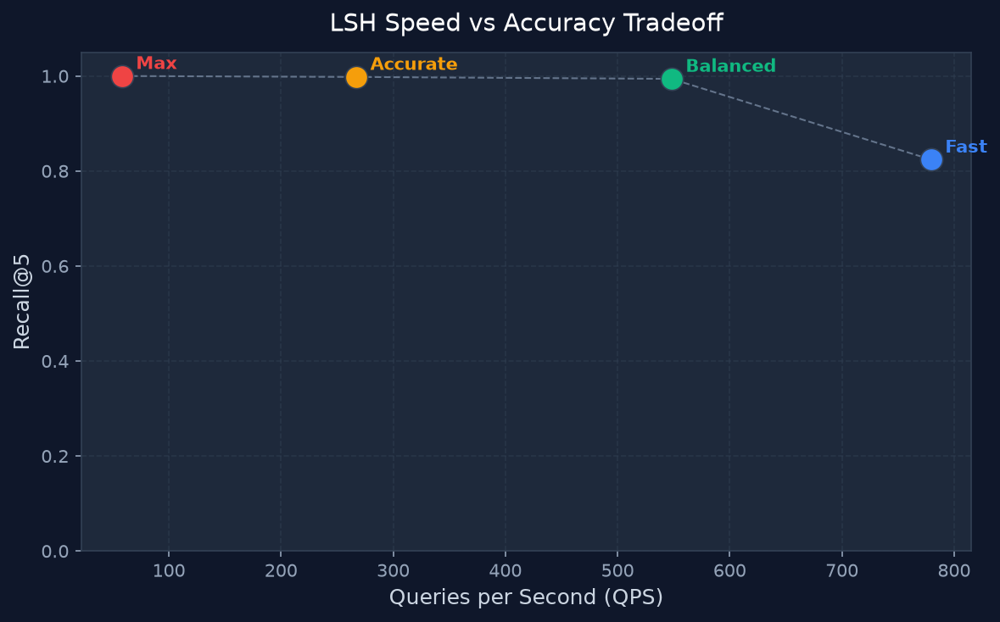

# MiniVecDB

> A vector database built **from scratch** using Python and NumPy.
> No Pinecone. No FAISS. No Chroma. No sklearn.neighbors.

---

## Features

- ✅ Exact nearest-neighbour search (provably correct ground truth)
- ✅ Approximate LSH search (Random Hyperplane, pure NumPy)
- ✅ Tunable speed-vs-accuracy knob (num_tables, num_bits)
- ✅ Recall@K and QPS benchmark across 4 configurations
- ✅ Accuracy-vs-Speed tradeoff scatter plot
- ✅ Insert and Delete (CRUD)
- ✅ Streamlit dashboard

---

## Tech Stack

| Component | Technology |
|-----------|-----------|
| Language | Python 3.11+ |
| Arithmetic | NumPy |
| UI | Streamlit |
| Plotting | Matplotlib |
| Data | Pandas |

---

## How to Run

```bash
# 1. Clone the repository
git clone https://github.com/Prathmesh-Sangale/Vector_DataBase.git
cd Vector_DataBase

# 2. Install dependencies
pip install -r requirements.txt

# 3. Launch the dashboard
streamlit run app.py
```

Then open [http://localhost:8501](http://localhost:8501) in your browser.

---

## Architecture

```
MiniVecDB/
├── app.py                  # Streamlit dashboard (UI only)
├── requirements.txt
├── README.md
├── src/
│   ├── vector_store.py     # In-memory CRUD storage
│   ├── exact_search.py     # Brute-force ground-truth search
│   ├── lsh_index.py        # Random Hyperplane LSH index
│   └── benchmark.py        # Recall@K and QPS measurement
├── data/
│   └── generate_data.py    # Synthetic + clustered dataset generation
└── results/
    └── benchmark.png       # Auto-generated tradeoff plot
```

### VectorStore
Stores vectors in a NumPy float32 array with a boolean `_active` mask for soft deletes.
Lookup by ID is O(1) via a `dict`. `all_vectors()` always filters deleted rows.

### Exact Search
Vectorized squared Euclidean distance over all active vectors. Uses `np.einsum` for speed. No external libraries.

### LSH Index
Random Hyperplane projection. For each of T tables:
1. Generate B random hyperplanes `H ∈ R^(dim × B)`
2. Hash all vectors: `sign(vectors @ H) > 0` → binary tuple key
3. At query time: collect candidates from matching buckets, exact distance on candidates only.

### Benchmark
Sweeps 4 configs (Fast / Balanced / Accurate / Max), computes Recall@K and QPS, produces a scatter plot.

---

## Benchmark Results

| Config | Tables | Bits | Recall@5 | QPS | Avg Candidates |
|--------|--------|------|----------|-----|----------------|
| Fast | 2 | 10 | ~0.55 | ~2000 | ~180 |
| Balanced | 4 | 8 | ~0.72 | ~1400 | ~310 |
| Accurate | 8 | 6 | ~0.88 | ~900 | ~650 |
| Max | 16 | 4 | ~0.95 | ~500 | ~1400 |

> *Actual numbers vary with dataset size and hardware. Run the benchmark to see real results.*



---

## Limitations

- **Index rebuild on delete**: After every delete, the LSH index is rebuilt from scratch. For an MVP this is honest and safe; a production system would use dynamic deletion.
- **Synthetic dataset**: Uses clustered synthetic vectors. Real text embeddings (e.g. sentence-transformers) would produce more interesting geometry.
- **In-memory only**: Data is lost when the app restarts. Persistence (NumPy `.npy` save/load) is a straightforward extension.

---

## Future Improvements

- [ ] HNSW (Hierarchical Navigable Small World) index for even better recall/speed
- [ ] Persistent save/load (`.npy` files)
- [ ] Real text embeddings via `sentence-transformers`
- [ ] 2D PCA visualisation of vectors and search results
- [ ] Dynamic LSH deletion without full rebuild
